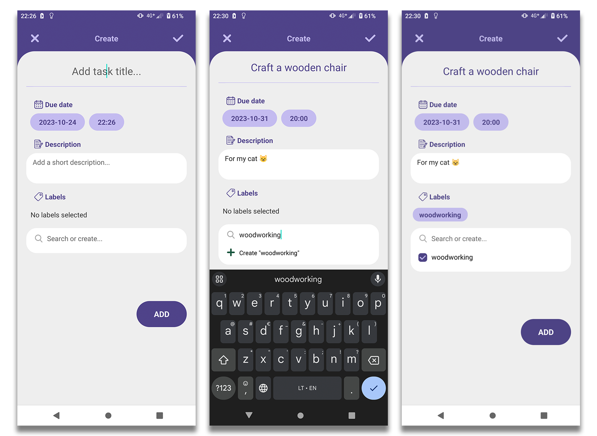

# PROGRESS tracker app

Progress tracker is a hybrid mobile app made using the React Native framework with the help of Expo.

> Note: This project was created in order to advance front-end and multi-platform mobile app development skills. It is by no means finished or ready for production. However, all implemented functionalities are fully operational in a debugging environment.

### How to add a new task?
1. Press Add button in the bottom right of the screen.
2. Fill the task with required data: title, description, due date (All fields are optional).
3. Add existing labels or create new ones.
4. Press ADD button or the tick at the top right corner to create task, or press cross at the top left - to discard.

### How to add subtasks?
1. Slect the task from main menu.
2. Press Add button in the bottom right of the screen.
3. Name the subtask.
4. Add weight to subtask (natural number).
5. Press Add button.

### How to manage tasks?
* To **sort** tasks, press on the label next to the sorting arrows and choose the sorting condition.
* To change **sorting order** press the sorting arrows icon.
* To **pin**/**unpin**, **edit** or **delete** task, press the three dots icon on a chosen task.

